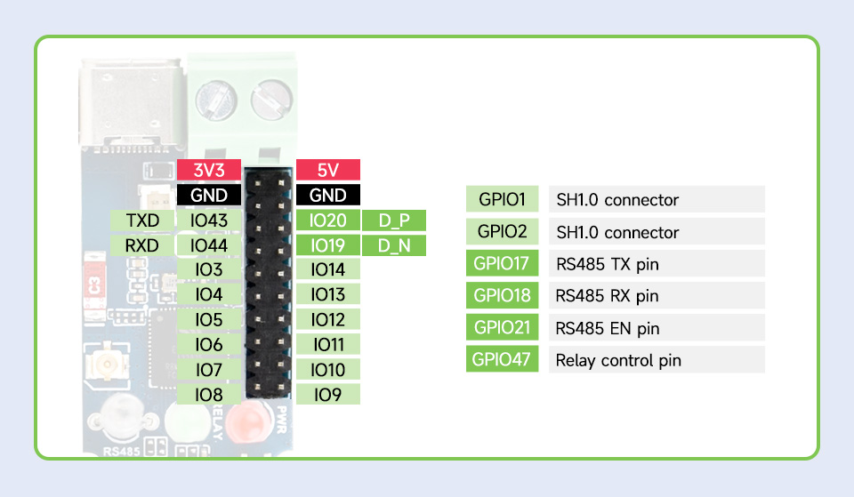

# ESP32-DMX-WiFi

Art-Net to DMX gateway and viceversa. It supports RDM and sACN (E1.31) too.


Strongly based on amazing [LXDMXWiFi_Library](https://github.com/claudeheintz/LXDMXWiFi_Library) example [ESP32-DMX_rdm](https://github.com/claudeheintz/LXDMXWiFi_Library/tree/master/examples/ESP32-DMX_rdm). Forked to Change Input/Output/Direction pins to test if this will work on the Waveshare Industrial 1-Channel ESP32-S3 WiFi Relay Module, Supports WiFi / Bluetooth / RS485 Control, With Multiple Isolation Protection Circuits, Rail-Mount Case. Relay would not be available.


Configuration utility for macOS and Windows is [here](https://github.com/claudeheintz/LXDMXWiFi_Library/tree/master/examples/configuration%20utility)

Changes from original source are:
```
#define STARTUP_MODE_PIN       0    // use onboard built-in button for force default setup
#define DIRECTION_PIN         21    // pin for output direction enable on RS-485 transceiver chip
#define DMXSERIAL_INPUT_PIN   18    // RX pin on WS RX485 board
#define DMXSERIAL_OUTPUT_PIN  17    // TX Pin on WS RX485 Board
#define STATUS_LED             2    // LED_BUILTIN for DOIT ESP32 DevKit V1

....

#define USE_REMOTE_CONFIG      0    // uncommented line for enable the configuration utility
```
